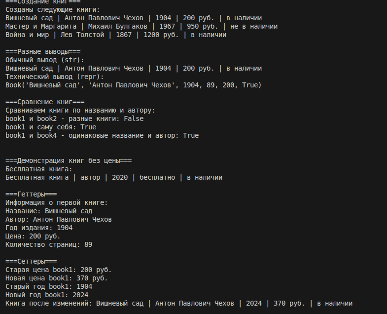
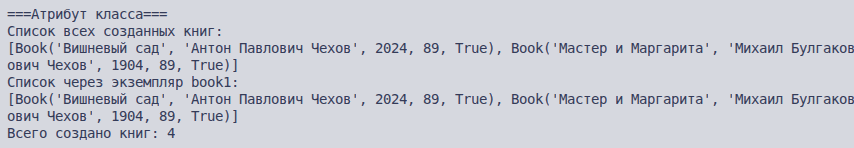
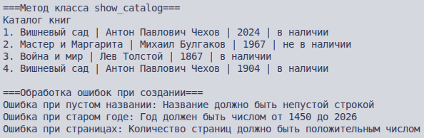

# Лабораторная 1  

## Вариант: Библиотека / Книги  

### Описание проекта
Реализация класса `Book` для библиотечной системы. Класс моделирует книгу с основными характеристиками и методами работы.

### Сущности
- **Book** — книга (основной класс)
- (Остальные сущности из варианта: Author, LibraryCard, Publisher, Reader — могут быть добавлены в будущем)

### Реализованные возможности

#### Атрибуты экземпляра (закрытые поля)
- `_title` — название книги
- `_author` — автор
- `_year` — год издания
- `_pages` — количество страниц
- `_is_available` — доступность (True/False)

#### Инварианты класса Book:
-  Название не может быть пустой строкой  
-  Автор не может быть пустой строкой  
-  Год издания от 1450 до 2026  
-  Количество страниц > 0  
-  Статус доступности - True/False   

#### Равенство
Две книги считаются равными, если у них совпадают название и автор.
(Это бизнес-логика: в библиотеке одинаковые книги не различаются по экземплярам)

#### Атрибут класса
- `_catalog_of_books` — список всех созданных книг

#### Магические методы
- `__str__` — красивое представление книги для пользователя
- `__repr__` — техническое представление для разработчика
- `__eq__` — сравнение книг по названию и автору

#### Состояние
Книга может находиться в двух состояниях:
- "в наличии" (is_available = True)  
- "не в наличии" (is_available = False)  

Правила, зависящие от состояния:
- Нельзя выдать книгу, если она не в наличии  
- Нельзя изменить год издания, если книга выдана читателю  

#### Свойства (@property) и сеттеры
- Геттеры для всех атрибутов
- Сеттеры для `year` с валидацией данных
- Валидация учитывает состояние книги (нельзя менять данные, если книга выдана)

#### Бизнес-методы
- `give_book()` — выдача книги читателю
- `return_book()` — возврат книги в библиотеку
- `repair()` — отправка книги на реставрацию
- `show_catalog()` — метод класса для отображения всех книг

#### Валидация данных
Валидация вынесена в отдельный класс BookValidator в файле validate.py:
- `_validate_title()`
- `_validate_author()`
- `_validate_year()`
- `_validate_pages()`

### Валидация реализована в отдельном файле validate.py

## demo.py 
### Сценарий 1. Создание и вывод  
В этом сценарии показано:
- Создание трех объектов класса Book с разными параметрами
- Использование __str__ для удобного вывода информации о книгах
- Использование __repr__ для технического представления  

  

### Сценарий 2. Работа с состоянием и бизнес-методы
Этот сценарий демонстрирует:
- Изменение состояния объекта через бизнес-методы  
- Как методы give_book() и return_book() меняют статус книги  
- Защиту от некорректных операций (нельзя выдать уже выданную книгу)  

  

### Сценарий 3. Валидация данных и работа с атрибутами класса
Этот сценарий показывает:
- Работу валидации при создании объектов (проверка пустых строк, диапазона годов)  
- Работу сеттера года с проверкой корректности  
- Атрибут класса _catalog_of_books, который хранит все созданные книги  
- Метод класса show_catalog() для просмотра всех книг  

  

  

