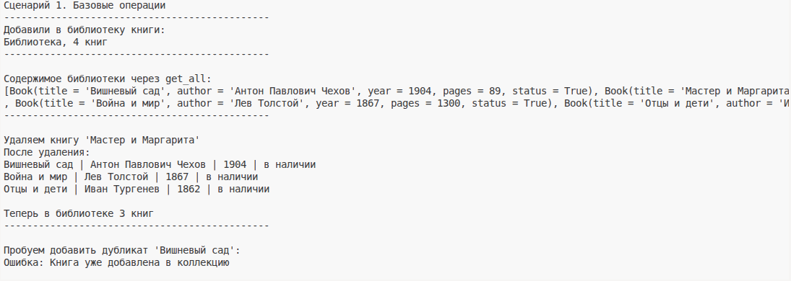
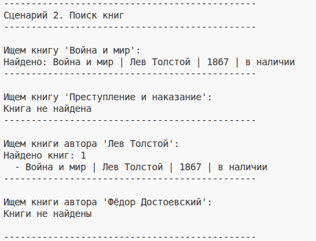
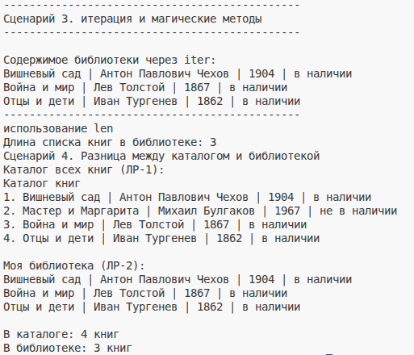

# Лабораторная работа №2 — Коллекция объектов

## 1. Цель работы
 Реализовать собственный контейнерный класс для хранения объектов класса `Book` из ЛР-1. Освоить итерацию по объектам и базовые операции управления коллекцией.

## 2. Описание реализованных классов

###  Класс `Library` 

Класс-контейнер для хранения и управления объектами `Book`.

**Атрибуты:**
- `_items` — закрытый список для хранения книг

**Методы управления коллекцией:**
- `add(book)` — добавление книги 
- `remove(book)` — удаление книги
- `get_all()` — возврат списка всех книг

**Методы поиска:**
- `find_by_title(title)` — поиск книги по названию 
- `find_by_author(author)` — поиск всех книг автора 

**Магические методы:**
- `__len__()` — возвращает количество книг в коллекции
- `__iter__()` — позволяет итерироваться по коллекции в цикле `for`
- `__str__()` — строковое представление библиотеки

## 3. Демонстрация работы

### Сценарий 1. Базовые операции

- Создание 4 книг
- Добавление книг в библиотеку
- Вывод содержимого библиотеки
- Удаление одной книги
- Попытка добавить дубликат (обработка ошибки)
- Вывод длины коллекции через `len()`

### Скриншот работы

### Сценарий 2. Поиск книг

- Поиск книги по названию (успешный)
- Поиск книги по названию (неуспешный — возврат `None`)
- Поиск книг по автору (успешный)
- Поиск книг по автору (неуспешный — пустой список)

### Скриншот работы

### Сценарий 3. Итерация и магические методы

- Перебор книг через `for book in library`
- Вывод длины коллекции через `len(library)`

### Скриншот работы

## 4. Вывод

В ходе выполнения лабораторной работы были изучены и закреплены следующие темы:

- **Коллекции объектов** — создание контейнерного класса для хранения группы объектов
- **Инкапсуляция** — использование закрытого поля `_items` для хранения коллекции
- **Итерация** — реализация `__iter__()` для перебора объектов в цикле `for`
- **Магические методы** — применение `__len__()` и `__str__()` для удобной работы с коллекцией
- **Поиск и фильтрация** — реализация методов поиска по атрибутам объектов
- **Валидация** — проверка типа добавляемых объектов и защита от дубликатов