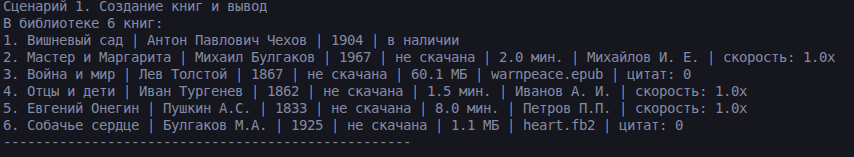
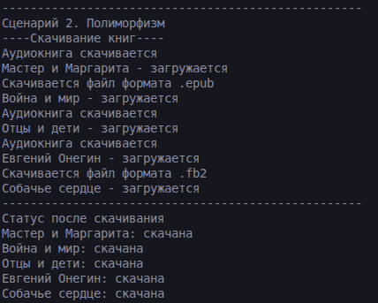
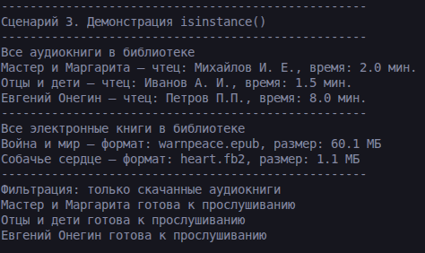
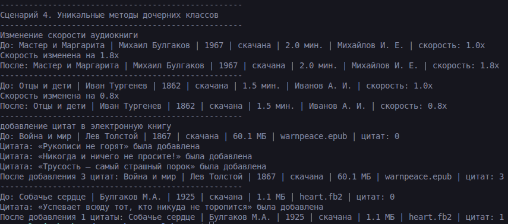

# Лабораторная работа №3 — Наследование и иерархия классов

## 1. Цель работы
Освоить механизм наследования классов и научиться строить иерархию объектов. Реализовать дочерние классы для `Book` из ЛР-1.  

## 2. Описание классов

- Базовый класс `Book`: описывает общие свойства печатного издания: название, автор, год, количество страниц и статус доступности. Он содержит методы выдачи, возврата и реставрации книги.  

- Дочерний класс `AudioBook`: добавляет специфичные для аудиоформата атрибуты: длительность записи, имя чтеца и скорость воспроизведения. Предоставляет методы скачивания и изменения скорости.  

- Дочерний класс `EBook`: добавляет атрибуты электронной книги: размер файла, формат и список сохранённых цитат. В нем есть методы скачивания и добавления цитат.

Полиморфный метод для классов - `download()`

## 3. Демонстрация работы

### Сценарий 1. Базовые операции

- Создание 6 книг разного формата
- Добавление книг в библиотеку
- Вывод содержимого библиотеки через переопределенный метод __str__

### Скриншот работы

### Сценарий 2. Полиморфизм

- Скачивание книг через метод download()  
- Вывод результата  

### Скриншот работы

### Сценарий 3. Проверка isinstance

- Проверка приндлежности книг к нужным дочерним классам  
- Вывод только скачанных книг `

### Скриншот работы

### Сценарий 4. Методы дочерних классов

- использование методы change_speed
- Использование метода quote

## 4. Вывод

В ходе выполнения лабораторной работы были изучены:
- Наследование (классы AudioBook и EBook)
- Полиморфизм (метод download)