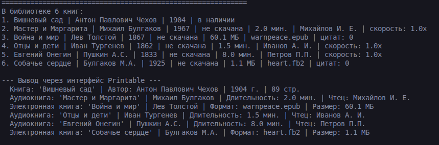
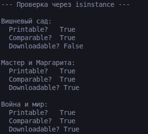
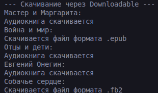

# Лабораторная работа №4

Познакомиться с абстрактными базовыми классами (ABC), освоить понятие интерфейса, научиться задавать обязательные методы для классов.
## 2. Описание классов

### - Printable
Требует реализации метода `to_string()` — возвращает детальное строковое представление объекта.

### - Cоmparable
Требует реализации метода `compare_to(other)` — сравнивает тодин объект с другим:
- отрицательное число: `self < other`
- 0: `self == other`
- положительное число: `self > other`

### - Downloadable
Требует реализации методов:
- `download()` — скачивание объекта
- `is_downloaded()` — проверка статуса скачивания

## Реализация в классах  

### Разное поведение методов

Метод `compare_to()` реализован по-разному в зависимости от класса:
- В `Book` — сравнение по году издания (чем меньше год, тем книга старше)
- В `AudioBook` — сравнение по длительности (чем меньше время, тем короче аудиокнига)
- В `EBook` — сравнение по году издания (аналогично `Book`)

Метод `to_string()` в каждом классе возвращает разный формат строки:
- `Book`: `Книга: 'Название' | Автор | Год г. | Страниц`
- `AudioBook`: `Аудиокнига: 'Название' | Автор | Время мин. | Чтец | статус`
- `EBook`: `Электронная книга: 'Название' | Автор | Формат | Размер МБ | статус`

## 4. Демонстрация работы

### Сценарий 1. Базовые операции

- Создание 6 книг разного формата
- Добавление книг в библиотеку
- Вывод содержимого библиотеки через переопределенный метод __str__  
- функция `print_all`, принимает список любых объектов, реализующих интерфейс `Printable`, и выводит их через метод `to_string()`  

### Скриншот работы

### Сценарий 2. Проверка через isinstance()  

- Проверка приндлежности книг к нужным дочерним классам  
- Вывод только скачанных книг 

### Скриншот работы

### Сценарий 3. Сравнение через Comparable

- Сравнение книг по году издания и аудиокниг по длительности

### Скриншот работы

### Сценарий 4.Скачивание  

- Скачивание объектов, реализующих интерфейс Downloadable  

## 4. Вывод

В ходе выполнения лабораторной работы были изучены:
- абстрактные базовые классы  
- интерфейсы  