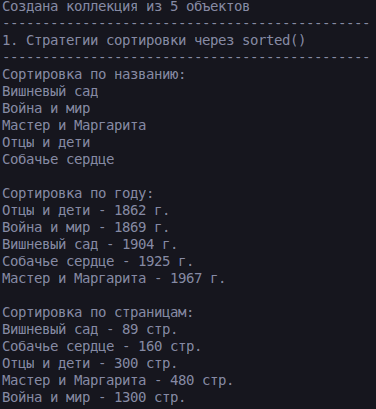
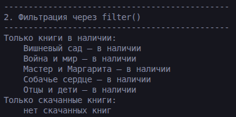
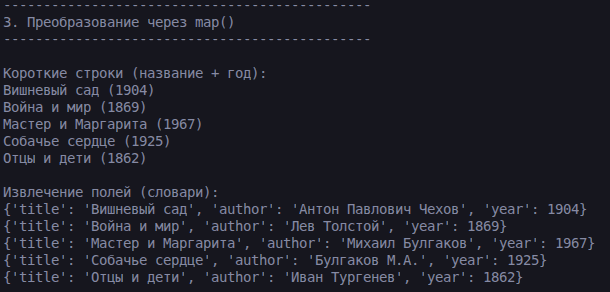
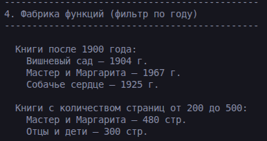
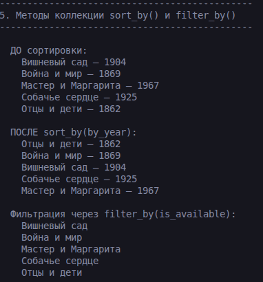
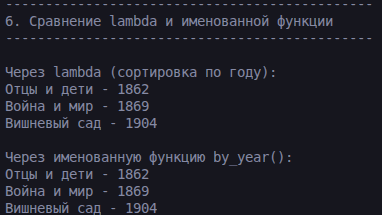

# Лабораторная работа 5

## 1. Цель работы
Освоить передачу функций как аргументов в другие функции и методы, научиться применять встроенные функции высшего порядка: map, filter, sorted.

## Описание  
### Функции-стратегии сортировки:
- `by_title(item)` - сортировка по названию: `sorted(collection, key=by_title)`    
- `by_year(item)` - сортировка по году издания: `sorted(collection, key=by_year)`    
- `by_pages(item)` - сортировка по страницам: `sorted(collection, key=by_pages)`  

### Функции-фильтры
- `is_available(item)` - отбор книг, доступных для выдачи: `True` если `_is_available == True`  
- `is_downloaded(item)` - отбор скачанных книг: `True` если у объекта есть атрибут `_is_downloaded` и он `True`  

### Фабрики функций  
- make_year_filter  
- make_pages_filter 

### Функции map  
- to_short_string(item)  
- extract_title_author(item)  

## 4. Демонстрация работы

### Сценарий 1. Три стратегии сортировки

- Создание коллекции из 5 объектов (книги, аудиокниги, электронные книги)
- Сортировка одной и той же коллекции тремя разными способами:
  - по названию (алфавитный порядок)
  - по году издания (от старых к новым)
  - по количеству страниц

### Скриншот работы

### Сценарий 2. Фильтрация через filter()

- Применение встроенной функции `filter()` с двумя разными предикатами:
  - `is_available` — отбор только книг, находящихся в наличии
  - `is_downloaded` — отбор только скачанных аудио/электронных книг

### Скриншот работы

### Сценарий 3. Преобразование через map()

- Применение `map()` для преобразования объектов:
  - преобразование в короткие строки вида "Название (год)"
  - извлечение полей (название, автор, год) в виде словарей

### Скриншот работы

### Сценарий 4. Фабрика функций

- Создание фильтров с параметрами через фабрику функций:
  - `make_year_filter(1900)` — отбор книг после 1900 года
  - `make_pages_filter(200, 500)` — отбор книг с количеством страниц от 200 до 500

### Скриншот работы

### Сценарий 5. sort_by() и filter_by()

- `sort_by(by_year)` - сортировка коллекции по году
- `filter_by(is_available)` - фильтрация коллекции

### Скриншот работы

### Сценарий 6. Lambda и именованная функция

- Сравнение двух способов достижения одного результата:
  - через lambda-выражение: `sorted(collection, key=lambda x: x.year)`
  - через именованную функцию: `sorted(collection, key=by_year)`
- Демонстрация одинакового результата

### Скриншот работы

### 5. вывод

В ходе выполнения лабораторной работы были изучены функции высшего порядка, фабрики функций, функции map