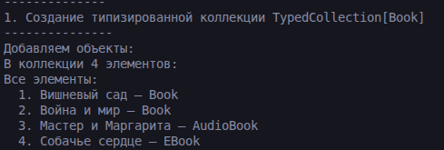
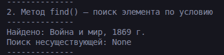
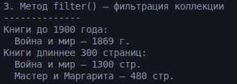
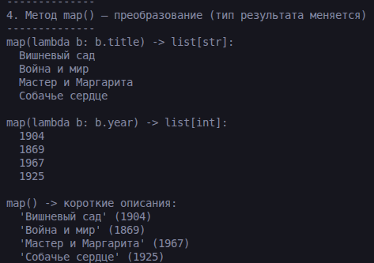
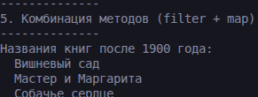

# Лабораторная работа 6

## 1. Цель работы
Освоить систему аннотаций типов в Python, научиться создавать обобщённые классы с помощью TypeVar и Generic.

## 2. Описание реализованных типов и контейнеров

### TypedCollection[Book] — коллекция для книг

**Основные методы:**
- `add(item: T)` — добавление элемента
- `remove(item: T)` — удаление элемента
- `get_all() -> List[T]` — получение всех элементов
- `__len__()` — количество элементов
- `__iter__()` — итерация по элементам

### TypeVar и Generic
В реализации использованы:
- `T = TypeVar('T')` — основной параметр типа для элементов коллекции
- `R = TypeVar('R')` — дополнительный параметр типа для метода map(), позволяющий менять тип результата

### Методы высшего порядка
- `find(predicate: Callable[[T], bool]) -> Optional[T]` — поиск первого элемента, удовлетворяющего условию
- `filter(predicate: Callable[[T], bool]) -> List[T]` — фильтрация элементов по условию
- `map(transform: Callable[[T], R]) -> List[R]` — преобразование элементов с возможностью смены типа результата

## 3. Демонстрация работы

### Сценарий 1. Создание типизированной коллекции

Создание `TypedCollection[Book]`, добавление объектов разных типов (Book, AudioBook, EBook). 

### Скриншот работы

### Сценарий 2. Метод find() — поиск элемента по условию

- Поиск существующей книги "Война и мир" - элемент найден
- Поиск несуществующей книги - None

### Скриншот работы

### Сценарий 3. Метод filter()

Применение разных условий фильтрации:
- Книги до 1900 года - возвращается список из одной книги
- Книги длиннее 300 страниц - возвращается список из 2 книг

### Скриншот работы

### Сценарий 4. Метод map()

Демонстрация изменения типа результата:
- `map(lambda b: b.title)` — `List[Book]` → `List[str]` (названия)
- `map(lambda b: b.year)` — `List[Book]` → `List[int]` (годы издания)
- `map(lambda b: f"'{b.title}' ({b.year})")` — `List[Book]` → `List[str]` (описания)

### Скриншот работы

### Сценарий 5. filter() и map()

- `filter()` отбирает книги после 1900 года
- выводятся названия отфильтрованных книг

### Скриншот работы

## 4. Аннотации типов в существующих классах

### Класс Book  
Добавлены аннотации типов:
- Параметры конструктора: `title: str`, `author: str`, `year: int`, `pages: int`, `is_available: bool`
- Атрибуты: `_title: str`, `_author: str`, `_year: int`, `_pages: int`, `_is_available: bool`
- Возвращаемые значения методов и свойств

### Класс Library
- `add(book: Book) -> None`
- `remove(book: Book) -> None`
- `get_all() -> List[Book]`
- `find_by_title(title: str) -> Optional[Book]`
- `find_by_author(author: str) -> List[Book]`

## 5. Вывод

В ходе выполнения лабораторной работы были изучены: Аннотации типов, Generic и TypeVar