# Лабораторная работа 7

## 1. Цель работы
Объединить все знания, полученные в ЛР1–ЛР6, в единое работающее приложение и реализовать интерактивный CLI-интерфейс с меню и вводом пользователя.
## 2. Организация файлов  
  
| Файл | Слой | Ответственность |
|------|------|-----------------|
| `main.py` | Точка входа | Запуск приложения, загрузка данных, создание объектов |
| `cli.py` | UI | Показ меню, ввод пользователя, вывод результатов |
| `app.py` | бизнес-логика | Добавление, удаление, поиск, выдача, возврат книг |
| `storage.py` | обработка данных | Сохранение коллекции в JSON, загрузка из JSON |
| `exceptions.py` | Общий слой | исключения предметной области |

CLI не имеет прямого доступа к классам `Book`, `AudioBook`, `EBook` и не создаёт их объекты. Все объекты создаются в `app.py` через фабричный метод `create_book_from_data()`. 

## 3. Описание CLI

### Пункты меню

| № | Операция | Описание |
|---|----------|----------|
| 1 | Показать все книги | Вывод всех книг в виде таблицы |
| 2 | Добавить книгу | Создание бумажной/аудио/электронной книги |
| 3 | Удалить книгу | Удаление по названию (с подтверждением) |
| 4 | Найти по названию | Поиск книги по названию |
| 5 | Найти по автору | Вывод всех книг указанного автора |
| 6 | Показать доступные | Вывод книг, которые не выданы |
| 7 | Фильтр по годам | Вывод книг за указанный диапазон лет |
| 8 | Выдать книгу | Изменение статуса на "выдана" |
| 9 | Вернуть книгу | Изменение статуса на "в наличии" |
| 10 | Сортировка | По названию, году, страницам, автору |
| 11 | Статистика | Общее количество, доступно, выдано, по типам |
| 12 | Очистить коллекцию | Удаление всех книг (с подтверждением) |
| 13 | Сохранить | Ручное сохранение в JSON |
| 14 | Загрузить из файла | Загрузка из JSON (с подтверждением) |
| 0 | Выход | Сохранение и выход из приложения |

### Обработка ошибок ввода  

- Проверка типов (число вместо строки)  
- Валидация диапазонов (год от 1450 до 2026)  
- Защита от пустых полей  
- Собственные исключения для бизнес-ошибок  

### Сохранение/загрузка  

Файл сохраняется в python_labs/data/library_data.json
- Автоматическая загрузка при запуске  
- Автоматическое сохранение при выходе  
- Ручное сохранение/загрузка через меню  
- Формат: JSON  
- Поддерживаются все типы книг (обычные, аудио, электронные)  

## Демонстрация работы

### Сценарий 1: Запуск и автозагрузка  

- Приветствие "Добро пожаловать в библиотечную систему"  
- Загрузка данных из файла data/library_data.json (пустая коллекция при первом запуске)  
- Отображение главного меню с пунктами 1-15  

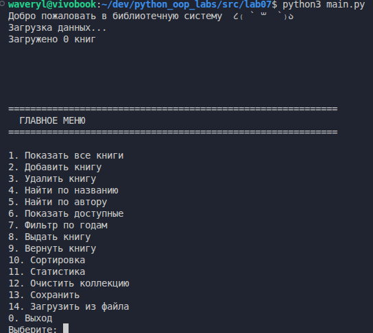  

### Сценарий 2: Добавление книги  

- Выбор пункта 2 "Добавить книгу"  
- Добавление 3 книг в коллекцию  

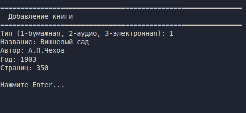  
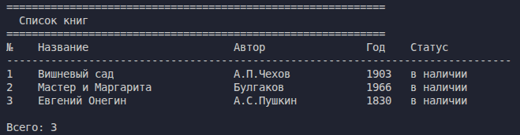  

### Сценарий 3: Сортировка  

- Выбор пункта 10 "Сортировка"
- Выбор стратегии сортировки: 2 (по году)

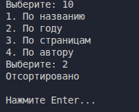  
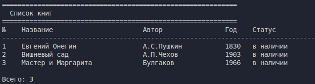  

### Сценарий 4: Фильтрация и поиск  

- Фильтр по годам     
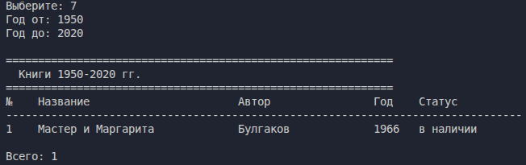  

- Поиск по названию  
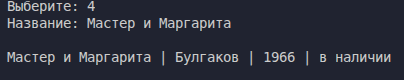  

- Поиск по автору   
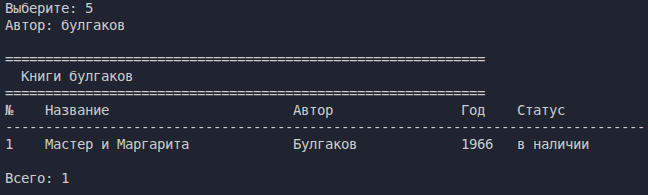  

### Сценарий 5: Обработка ошибок  

- Попытка добавить существующую книгу  
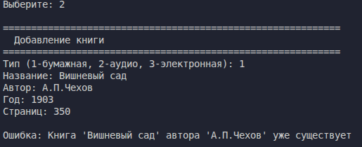  

- Удаление несуществующей книги  
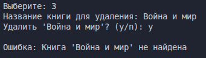  

Некорректные данные пользователя:  
- Тип книги и года вне диапазона  
- Пустой автор и название  
- Неверный формат года, страниц, файла  
  
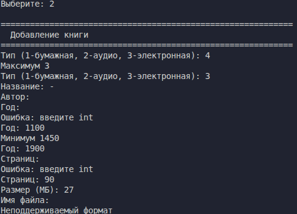  

## Вывод  
В ходе выполнения лабораторной работы были изучены:  

- CLI-интерфейс  
- обработка исключений  
- работа с файлами и типизация  